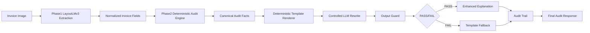

# ARCHITECTURE.md

## 模块职责

- `procureguard.models`：冻结的共享 Pydantic 契约。
- `procureguard.api`：FastAPI 上传、查询和人工审核接口。
- `procureguard.services`：后端真实规则链、三单匹配、Policy RAG 和 Risk Engine。
- `procureguard.tools`：Agent 可调用的 5 个固定工具。
- `procureguard.extraction`：Phase 1 模型抽取模块，负责 OCR token 契约、PaddleOCR 可选适配、SROIE reader、OCR baseline、字段级 F1、错误分析和后续 LayoutLMv3 训练输入。
- `procureguard.phase3`：Phase 3 独立异常说明数据契约、synthetic 生成逻辑和统一解释评测，不修改共享业务 schema。

## 调用关系

当前主链仍由 API 层提供占位 ExtractedFields，再交给 AgentInvoiceProcessor 审核。Phase 1 暂时不接入 API，只产出独立抽取能力。后续替换时，应让上传接口调用抽取模块生成 ExtractedFields，然后复用现有 AgentInvoiceProcessor。

Phase 3A 暂不接入主链。它读取 Phase 2 已确定的异常事实作为离线训练输入，输出解释文本；Risk Engine、建议动作和工具调用结果始终是上游只读事实。

Phase 3H 将解释层改为受控架构：Phase 2 输出 Canonical Audit Facts，确定性模板渲染器作为 MVP 官方解释输出，LoRA 只可作为 shadow/experimental controlled rewrite。任何 LLM 输出必须通过 guard；失败、不可用、空输出或高风险场景都回退到模板。

## Phase 1 设计

- PaddleOCR 只在实际 OCR 时延迟加载，避免普通后端运行依赖重型包。
- OCR + Regex baseline 输出独立 Phase 1 结果结构，不修改共享 ExtractedFields。
- SROIE 字段只可选映射到现有字段：company -> vendor_name，date -> invoice_date，total -> total_amount。
- 字段级 F1 和错误分析使用 normalized exact match，可在没有 GPU 和模型依赖时快速验证。
- BIO alignment 把 SROIE 字段对齐到 OCR token，标签只包含 company、address、date、total。
- LayoutLMv3 Dataset 读取 processed JSONL、图片、bbox 和 BIO labels，并使用 `apply_ocr=False` 的 processor。
- Notebook 保留手写 PyTorch 训练循环，用于后续真实 fine-tuning 和 checkpoint。
- ModelScope 适配层只负责识别镜像并复制整图和 OCR annotation；crop OCR 标签不会被伪装成四字段 entity ground truth。
- Hugging Face Task 3 适配层读取 FiftyOne `samples.json` 中的 entity metadata 和 OCR detections，生成固定 seed 的 train/validation processed JSONL。
- LayoutLMv3 训练优先使用数据集 OCR annotation，PaddleOCR 单独验证端到端图片推理路径。
- GPU Notebook 在 ModelScope 与 Colab 共享同一训练主体，环境差异只放在初始化单元格。
- 训练输出按 best field macro F1 保存 checkpoint，并导出日志、loss 曲线、token F1、field F1 和错误分析。
- `gpu_notebook.py` 统一负责 Kernel 依赖验证、跨平台图片路径修复、本地模型检查和训练 guard。
- bootstrap 脚本可写修复与环境摘要，verify 脚本只读检查；Notebook 只调用统一入口，不重复环境逻辑。
- `gpu_notebook_context.py` 在当前 Notebook Kernel 内一次性恢复真实 BIO 标签、样本、processor、Torch、device 和训练配置，避免依赖子进程注入变量。
- 本地 LayoutLMv3 只接受 `model.safetensors`，processor 和模型均离线加载，不回退到 `pytorch_model.bin`。
- 字段重建统一经过 `field_reconstruction.py`；日期 span 会去掉 `DATE:`、时间和其他非日期文本。
- Phase 1 MVP 默认离线策略为 corrected pure LayoutLMv3；同一 142 条本地 validation 上 date F1 从 0.1423 提升到 0.8764，macro F1=0.8067。Hybrid macro F1=0.7949，仅保留为 fallback 思路。
- `compare_date_reconstruction.py` 复用同一 checkpoint token predictions，对比旧/新日期重建并输出实际 F1 恢复，不触发训练。
- Phase 1G 结果属于 `offline_checkpoint_inference` 和 `local_validation_split_seed_42`，不是 official test，尚未接入 API。

## Phase 3 设计

- `schemas.py` 定义独立 `AnomalySample` 和 `InputFacts`，不修改 `AuditReport`、`ValidationResult` 或其他共享契约。
- `dataset.py` 使用 seed 42 生成 8 类共 200 条 synthetic 样本，固定拆分为 160/20/20。
- `evaluation.py` 统一计算 format compliance、factual consistency、action consistency、anomaly coverage 和 hallucination rate。
- `gpu_notebook.py` 统一负责 Phase 3 Notebook bootstrap、verify、数据 SHA 校验、模型目录 guard、输出目录 guard 和 base inference smoke dry-run。
- `runtime.py` 在当前 Notebook Kernel 内恢复数据、prompt、训练参数、LoRA 参数和生成参数。
- Notebook 优先使用 Unsloth 微调 `Qwen/Qwen2.5-0.5B-Instruct`，并保留 Transformers + PEFT + TRL fallback。
- Notebook 默认关闭训练和 base 推理，只执行路径、数据、依赖、模型目录和 CUDA smoke guard；真实预测存在后才调用统一评测脚本。
- adapter、checkpoint、模型缓存、训练日志和推理结果写入 `artifacts/phase3/`，不提交 Git。
- 第二轮 LoRA 真实评测未通过 hard gate，fine-tuned 结果为 format_compliance=0.0000、factual_consistency=0.9000、action_consistency=0.4500、anomaly_coverage=0.4250、hallucination_rate=0.1500。
- LoRA 不接 API、不作为默认用户输出、不参与风险或动作决策；第三轮训练暂停。

## Phase 3H 受控解释层



- Canonical Audit Facts 是解释层唯一事实来源，包含 `anomaly_types`、`evidence`、`missing_fields`、`risk_level` 和 `recommended_action`。
- Deterministic Template Renderer 是 MVP 默认官方输出，不依赖模型，保证同一事实输入得到同一解释。
- Controlled LLM Rewrite 只能润色模板语言，不能新增事实、删除事实或改变审核结论。
- Output Guard 检查未知 PO/GRN/发票号/金额/供应商/政策/审批角色/异常类型，以及风险等级、建议动作和固定章节是否被改变。
- Fallback Orchestrator 在 LoRA 不可用、输出为空、guard 失败、高风险或解析失败时返回模板。
- Audit Trail 记录 facts hash、template version、prompt version、model version、adapter version、raw LLM output、verifier result、fallback reason 和 final explanation。
- Phase 3H.2 在 `AgentInvoiceProcessor` 完成 Phase 2 风险与动作判断、构建 `AuditReport` 后调用解释层；解释结果不能写回 matcher、Risk Engine、工具调用或人工审核决策。
- `AuditReport.explanation` 是向后兼容的可选字段，API 默认 `explanation_mode=template`。shadow/experimental 必须显式选择并注入 provider，项目默认没有真实模型 provider。
- Explanation Audit Trail 采用方案 B，随 `audit_report_json` 的 explanation metadata 保存和返回。现有 `audit_traces.step_name` CHECK 保持不变，不新增表、字段或 migration。
- Phase 3H.3 Demo Cases 固定放在 `tests/fixtures/phase3h_demo_cases.json`，只使用 fake provider 和确定性输入。
- Demo 首次部署优先采用混合模式：固定或预生成 ExtractedFields 进入实时 Phase 2、Canonical Facts、模板解释和 AuditReport；固定样例作为 fallback。完整在线 LayoutLMv3 需要单独完成模型资产、资源和冷启动实测。
- `demo.demo_service` 负责 fixture adapter、实时混合链、fake provider 和静态 fallback；`demo.app` 只负责 Gradio 组件和展示映射，不复制 Phase 2 风险或 guard 逻辑。
- 本地 Gradio 默认运行 `normal_invoice + template`，只绑定 `127.0.0.1`。静态 fallback 会显式展示 execution path、fallback reason 和安全错误摘要。

## Portfolio Demo Presentation Architecture

Portfolio Demo 只扩展展示层，不改变已封板的业务主链。最终统一为一个 Gradio App：

```text
Tab 1: Invoice Audit
  -> pre-generated ExtractedFields
  -> live Phase 2 / Policy RAG / Risk Engine
  -> Canonical Facts / Template / Guard / Fallback
  -> AuditReport

Tab 2: Model Lab
  -> real offline LayoutLMv3 artifacts
  -> real offline LoRA run artifacts
  -> metrics / curves / predictions / error analysis

Tab 3: Architecture
  -> model, Agent tools, deterministic rules and governance boundaries
```

展示数据分为三类：

- **默认实时结果**：Phase 2 主链、Policy RAG、Risk Engine、Canonical Facts、模板解释、Guard/Fallback 演示和 AuditReport。
- **真实离线 artifacts**：LayoutLMv3 训练与 checkpoint inference 证据，以及两轮 QLoRA 的参数、loss、指标和 hallucination 案例。
- **后续 optional live inference**：在线 LayoutLMv3、在线真实 LoRA、GPU Space 和 Phase 3I；这些能力当前未实现，也不作为免费 CPU Demo 的 blocker。

当前 Local Gradio Demo 是 Tab 1 的稳定基线，不会被推翻。后续只在展示层增加 Model Lab 与 Architecture，并评估让 `normal_invoice`、`missing_po_number`、`duplicate_invoice`、`amount_discrepancy` 中 3 至 4 个案例走实时链；无法精确复现的案例继续明确标记 `STATIC FALLBACK`，且不修改 Phase 2 风险规则。

## Engineering Delivery Layer

- `procureguard.integrations.langchain_policy_demo` 是独立可选兼容层，只读取本地 mock 政策并返回来源、分数和匹配词；不进入 API 默认路径。
- `Dockerfile` 与 `docker-compose.yml` 提供 CPU-only API 和 Unified Demo 服务，默认镜像只安装 `demo` extra。
- `.github/workflows/ci.yml` 在 CPU runner 安装 `demo + langchain + test` extras，执行离线 smoke、专项测试、readiness 和全量回归。
- `verify_portfolio_release_readiness.py` 只读聚合本地证据，并把 HF 在线部署和 Docker runtime 状态与本地配置状态分开。
- 默认后端、Demo、LangChain、Phase 1 与 Phase 3 GPU 依赖继续隔离；没有模型权重进入 Docker、CI 或 HF 本地发布包。

## Public Portfolio Deployment

- Hugging Face Space 公开运行 CPU-only Unified Demo：Invoice Audit、Model Lab 和 Architecture。
- Invoice Audit 使用预生成字段与确定性业务链；Model Lab 只读取离线 JSON artifacts；Architecture 只展示治理边界。
- 公网 runtime 不加载 LayoutLMv3、Qwen 或真实 LoRA，不使用 GPU、API Key、secrets 或外部模型 API。
- 公开部署不改变 Phase 1、Phase 2、Phase 3H 或数据库 schema，也不代表生产可用或 official test。
