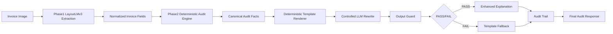

# ProcureGuard AI — 企业采购发票智能审核 Agent
## 完整工程设计方案 v1.0

> **项目定位**：面向企业采购与财务场景，自动读取发票/收据/采购订单，完成字段抽取、三单匹配、异常检测、政策核验与人工审批流转的端到端 AI Agent 系统。
>
> **你的核心目标**：通过这个项目证明你能做 PyTorch 模型微调 + Agent 工程落地，补齐 ContextGraph Studio 在模型训练层面的空白。

---

## 0. 项目边界与交付物

### MVP 必须交付
| 交付物 | 说明 |
|--------|------|
| LayoutLMv3 微调 Notebook | 在 SROIE/CORD 数据集上训练，有 F1 对比数据 |
| 异常说明 LoRA Notebook | Qwen2.5-0.5B SFT，有 base vs fine-tuned 对比 |
| FastAPI 后端服务 | 发票上传、处理、结果查询 |
| Agent 工作流 | 5 个工具 + function calling 主链 |
| Policy RAG 模块 | 复用 ContextGraph 检索逻辑 |
| 结构化 JSON 输出 | 符合 AuditReport schema，含风险等级和证据链 |
| Docker Compose | 一键启动整个服务 |
| GitHub Actions CI | pytest + model smoke test |

### MVP 不做
- 真实企业数据库对接
- 完整付款执行（只做审核，不做付款）
- 多语言发票（先做英文）
- 完整前端 UI（CLI + API 够用）
- 真实企业 ERP 对接

---

## 1. 系统架构总览

```
用户上传发票 PDF / 图片
  ↓
[Intake Classifier]  →  判断文档类型（invoice/receipt/PO/GRN）
  ↓
[OCR + LayoutLMv3 Extractor]  →  抽取结构化字段
  ↓
[Validation Engine]  →  确定性规则：三单匹配 / 重复检测 / 金额校验
  ↓
[Agent Tool Router]  →  LLM function calling 决定下一步工具
  ├── lookup_purchase_order
  ├── lookup_goods_receipt
  ├── check_duplicate_invoice
  ├── retrieve_policy  ← Policy RAG
  └── submit_manual_review
  ↓
[Risk Engine]  →  确定性规则计算风险等级（low/medium/high）
  ↓
[Anomaly Explainer]  →  LoRA 微调小模型生成自然语言异常说明
  ↓
[Audit Report Generator]  →  输出结构化 JSON + Markdown 报告
```

**关键设计原则**：
- LLM 负责规划、解释、选工具
- 确定性规则负责金额计算、匹配逻辑、风险阈值
- 人类负责中高风险最终决策

### Phase 3H 受控解释接入

当前 MVP 已将异常解释调整为受控后置层：

```text
Phase 2 确定性审核结果
  -> Canonical Audit Facts
  -> Deterministic Template Renderer
  -> optional shadow/experimental rewrite
  -> structured guard
  -> template default or safe fallback
  -> additive AuditReport.explanation
```

- 默认 API 模式为 deterministic template，不依赖真实 LoRA、网络或 GPU。
- shadow 只记录 fake/provider rewrite 和 guard 结果，不改变正式解释。
- experimental 只有显式启用且 guard PASS 时才采用 rewrite。
- 高风险、provider 不可用、空输出、非法输出、运行异常或解析异常都回退模板。
- explanation trace 保存在现有 `audit_report_json` 的可选 metadata 中，不修改数据库 schema。
- 当前 guard 是结构化规则 guard，不是生产级语义校验器。
- 当前没有第三次训练、HF Spaces 或 LangChain 对比实验。

### Demo Deployability Review

Phase 3H 合并后，首次公开 Demo 的推荐边界是：

- 默认使用固定或预生成 `ExtractedFields`，实时运行 Phase 2、Canonical Facts、确定性模板和解释审计信息；
- 13 个固定样例作为离线 fallback；
- 默认不需要 API Key、GPU、网络、Qwen 或 LoRA；
- 完整在线 LayoutLMv3 的 checkpoint 托管、CPU/GPU、内存、冷启动和下载时延均待实测；
- 当前 readiness 只代表本地离线准备情况，不代表 Hugging Face Spaces 已部署或线上通过。

### Local Gradio Demo

本地 Demo 将 UI 与业务逻辑分离：

```text
demo.app
  -> demo.demo_service
  -> pre-generated ExtractedFields
  -> Phase 2 deterministic audit
  -> Phase 3H guarded explanation
  -> Gradio output
```

- 默认 `normal_invoice + template` 运行实时混合链。
- 现有 Phase 2 无法精确复现的固定场景使用明确标记的 static fallback。
- shadow 与 experimental 只使用 fake provider。
- 页面展示 explanation trace 和完整 AuditReport JSON。
- 本地启动不 share、不需要 API Key/GPU，不加载在线 LayoutLMv3、Qwen 或真实 LoRA。
- 当前没有创建 Hugging Face Space，也不代表线上部署完成。

---

## 2. 数据库 Schema

```sql
-- 发票记录
CREATE TABLE invoices (
    id TEXT PRIMARY KEY,
    file_path TEXT NOT NULL,
    file_hash TEXT NOT NULL,        -- SHA256，防重复上传
    upload_time INTEGER NOT NULL,
    status TEXT NOT NULL,           -- 'pending'|'processing'|'approved'|'rejected'|'review'
    risk_level TEXT,                -- 'low'|'medium'|'high'
    extracted_fields_json TEXT,     -- LayoutLMv3 抽取结果
    validation_result_json TEXT,    -- 三单匹配结果
    audit_report_json TEXT          -- 最终审计报告
);

-- 采购订单（Mock 数据）
CREATE TABLE purchase_orders (
    po_number TEXT PRIMARY KEY,
    vendor_name TEXT NOT NULL,
    total_amount REAL NOT NULL,
    currency TEXT NOT NULL,
    line_items_json TEXT,           -- [{item, qty, unit_price}]
    created_date TEXT,
    status TEXT                     -- 'open'|'closed'|'cancelled'
);

-- 收货记录（Mock 数据）
CREATE TABLE goods_receipts (
    grn_number TEXT PRIMARY KEY,
    po_number TEXT NOT NULL,
    received_date TEXT NOT NULL,
    line_items_json TEXT,           -- [{item, received_qty}]
    receiver TEXT
);

-- 审计追踪
CREATE TABLE audit_traces (
    id TEXT PRIMARY KEY,
    invoice_id TEXT NOT NULL REFERENCES invoices(id),
    step_name TEXT NOT NULL,        -- 'extraction'|'validation'|'agent_call'|'risk_calc'
    input_json TEXT,
    output_json TEXT,
    tool_calls_json TEXT,           -- LLM 的 function calling 记录
    latency_ms INTEGER,
    created_at INTEGER NOT NULL
);

-- 人工审核队列
CREATE TABLE review_queue (
    id TEXT PRIMARY KEY,
    invoice_id TEXT NOT NULL REFERENCES invoices(id),
    risk_level TEXT NOT NULL,
    reason_codes_json TEXT,         -- ["quantity_mismatch", "amount_discrepancy"]
    evidence_json TEXT,
    assigned_to TEXT,
    status TEXT NOT NULL,           -- 'pending'|'approved'|'rejected'
    reviewer_comment TEXT,
    created_at INTEGER NOT NULL,
    resolved_at INTEGER
);

-- 政策文档（Mock 数据 + RAG 检索）
CREATE TABLE policy_documents (
    id TEXT PRIMARY KEY,
    section TEXT NOT NULL,
    content TEXT NOT NULL,
    created_at INTEGER NOT NULL
);

-- SQLite FTS5 虚拟表，用于 BM25 政策检索
CREATE VIRTUAL TABLE policy_fts USING fts5(
    content,
    section,
    content='policy_documents',
    content_rowid='rowid'
);
```

---

## 3. Phase 1：LayoutLMv3 微调（第 1-2 周）

### 3.1 这一 Phase 的目标

产出一个 Jupyter Notebook，能在面试里打开展示：
- 完整的 PyTorch 训练循环（Dataset / DataLoader / forward / loss / optimizer / checkpoint）
- SROIE 数据集上的字段抽取结果
- baseline vs fine-tuned 的 F1 对比表
- 错误案例分析

**这一 Phase 完成就可以在简历写"使用 PyTorch + Transformers 微调 LayoutLMv3"。**

### 3.2 数据集选择

**主数据集：SROIE（ICDAR 2019）**
- 626 张训练收据 + 347 张测试收据
- 4 个字段：company、date、address、total
- 下载：`https://github.com/zzzDavid/ICDAR-2019-SROIE`

**补充数据集：CORD**
- 800 张训练 + 100 张验证 + 100 张测试
- 54 个字段，更接近发票场景
- Hugging Face：`naver-clova-ix/cord-v2`

**自建异常样本（50 张，用 reportlab 生成）**
```python
# 生成策略
anomaly_types = [
    "quantity_mismatch",    # 发票数量 vs PO 数量不一致
    "duplicate_invoice",    # 相同发票号重复提交
    "amount_discrepancy",   # 金额计算错误
    "missing_po_number",    # 缺少 PO 号
    "vendor_name_mismatch", # 供应商名称不一致
]
# 每种类型生成 10 张，标注异常标签
```

**数据来源说明（必须在 README 里写清楚）**
```markdown
## Dataset

- SROIE: ICDAR 2019 competition dataset (public)
- CORD: Naver Clova AI (public, Hugging Face)
- Synthetic anomaly samples: generated with reportlab (50 samples, self-annotated)

All public datasets are used for research purposes only.
```

### 3.3 OCR 选型

| 方案 | 优点 | 缺点 | 推荐场景 |
|------|------|------|---------|
| PaddleOCR | 开源、精度高、中英文 | 依赖稍重 | 主力选择 |
| Tesseract | 轻量、完全离线 | 复杂版面差 | fallback |
| Google Cloud Vision | 精度最高 | 收费、需网络 | 不用 |

**选 PaddleOCR**，理由：开源、精度够、GitHub 上 LayoutLMv3 项目普遍使用。

```python
from paddleocr import PaddleOCR

ocr = PaddleOCR(use_angle_cls=True, lang='en')

def get_ocr_result(image_path: str) -> list[dict]:
    """
    返回格式：[{text, bbox: [x1,y1,x2,y2], confidence}]
    bbox 需要归一化到 0-1000（LayoutLMv3 要求）
    """
    result = ocr.ocr(image_path)
    words = []
    img = Image.open(image_path)
    width, height = img.size
    for line in result[0]:
        bbox = line[0]  # [[x1,y1],[x2,y1],[x2,y2],[x1,y2]]
        text = line[1][0]
        # 转为 LayoutLMv3 格式：[x0, y0, x1, y1]，归一化到 0-1000
        x0 = int(min(p[0] for p in bbox) / width * 1000)
        y0 = int(min(p[1] for p in bbox) / height * 1000)
        x1 = int(max(p[0] for p in bbox) / width * 1000)
        y1 = int(max(p[1] for p in bbox) / height * 1000)
        words.append({"text": text, "bbox": [x0, y0, x1, y1]})
    return words
```

### 3.4 LayoutLMv3 训练代码结构

```python
# 完整训练循环，自己写，不要用 Trainer 包装（面试可以解释每一步）

import torch
from torch.utils.data import Dataset, DataLoader
from transformers import LayoutLMv3Processor, LayoutLMv3ForTokenClassification
from torch.optim import AdamW
from torch.optim.lr_scheduler import LinearLR

# ── 1. Dataset ──────────────────────────────────────────
class InvoiceDataset(Dataset):
    def __init__(self, data: list[dict], processor, label2id: dict):
        self.data = data
        self.processor = processor
        self.label2id = label2id

    def __len__(self):
        return len(self.data)

    def __getitem__(self, idx):
        item = self.data[idx]
        # item 格式：{image_path, words, bboxes, labels}
        image = Image.open(item["image_path"]).convert("RGB")
        encoding = self.processor(
            image,
            item["words"],
            boxes=item["bboxes"],
            word_labels=item["labels"],
            truncation=True,
            padding="max_length",
            max_length=512,
            return_tensors="pt",
        )
        return {k: v.squeeze(0) for k, v in encoding.items()}

# ── 2. 训练循环 ────────────────────────────────────────
def train(
    model,
    train_loader,
    val_loader,
    optimizer,
    scheduler,
    epochs: int = 10,
    device: str = "cuda" if torch.cuda.is_available() else "cpu",
):
    model.to(device)
    best_val_loss = float("inf")

    for epoch in range(epochs):
        # ── Train ──
        model.train()
        train_loss = 0.0
        for batch in train_loader:
            batch = {k: v.to(device) for k, v in batch.items()}
            outputs = model(**batch)
            loss = outputs.loss

            optimizer.zero_grad()
            loss.backward()           # backpropagation
            torch.nn.utils.clip_grad_norm_(model.parameters(), 1.0)
            optimizer.step()
            scheduler.step()
            train_loss += loss.item()

        # ── Validate ──
        model.eval()
        val_loss = 0.0
        with torch.no_grad():
            for batch in val_loader:
                batch = {k: v.to(device) for k, v in batch.items()}
                outputs = model(**batch)
                val_loss += outputs.loss.item()

        avg_train = train_loss / len(train_loader)
        avg_val = val_loss / len(val_loader)
        print(f"Epoch {epoch+1}/{epochs} | Train Loss: {avg_train:.4f} | Val Loss: {avg_val:.4f}")

        # ── Checkpoint ──
        if avg_val < best_val_loss:
            best_val_loss = avg_val
            model.save_pretrained("checkpoints/best_model")
            print(f"  → Saved best model (val_loss={avg_val:.4f})")

# ── 3. 启动训练 ────────────────────────────────────────
id2label = {0: "O", 1: "B-VENDOR", 2: "I-VENDOR", 3: "B-DATE",
            4: "B-INVOICE_NO", 5: "B-TOTAL", 6: "B-PO_NUMBER"}
label2id = {v: k for k, v in id2label.items()}

processor = LayoutLMv3Processor.from_pretrained(
    "microsoft/layoutlmv3-base", apply_ocr=False
)
model = LayoutLMv3ForTokenClassification.from_pretrained(
    "microsoft/layoutlmv3-base",
    id2label=id2label,
    label2id=label2id,
)
optimizer = AdamW(model.parameters(), lr=1e-5)
scheduler = LinearLR(optimizer, start_factor=1.0, end_factor=0.1, total_iters=100)

train(model, train_loader, val_loader, optimizer, scheduler, epochs=10)
```

### 3.5 评测指标（必须在 Notebook 里跑）

```python
from seqeval.metrics import classification_report, f1_score

def evaluate(model, test_loader, id2label, device):
    model.eval()
    all_preds, all_labels = [], []

    with torch.no_grad():
        for batch in test_loader:
            batch = {k: v.to(device) for k, v in batch.items()}
            outputs = model(**batch)
            predictions = outputs.logits.argmax(-1)

            # 过滤 padding 和 special tokens（label == -100）
            for pred_seq, label_seq in zip(predictions, batch["labels"]):
                preds, labels = [], []
                for p, l in zip(pred_seq, label_seq):
                    if l != -100:
                        preds.append(id2label[p.item()])
                        labels.append(id2label[l.item()])
                all_preds.append(preds)
                all_labels.append(labels)

    print(classification_report(all_labels, all_preds))
    return f1_score(all_labels, all_preds)
```

**对比表格（Notebook 最后输出这个）**

| 模型配置 | Vendor F1 | Invoice No F1 | Date F1 | Total F1 | Macro F1 |
|---------|-----------|---------------|---------|----------|----------|
| OCR + Regex baseline | 待测 | 待测 | 待测 | 待测 | 待测 |
| LayoutLMv3 zero-shot | 待测 | 待测 | 待测 | 待测 | 待测 |
| LayoutLMv3 fine-tuned | 待测 | 待测 | 待测 | 待测 | 待测 |

### 3.6 错误分析（面试关键）

```python
# 必须做错误归因，不是只截图 loss 曲线
error_categories = {
    "ocr_error": [],        # OCR 识别错误导致字段抽取失败
    "layout_change": [],    # 发票模板变化导致位置判断失误
    "low_quality": [],      # 图片清晰度不足
    "missing_field": [],    # 发票本身缺少该字段
    "multi_currency": [],   # 多币种混合
}
# 对每个错误案例：记录 image_id, field, predicted, ground_truth, error_type
```

### 3.7 Google Colab 配置（你用 CPU 只有 2GB GPU 的情况）

```python
# Colab 运行，免费 T4 GPU 15GB
# 训练配置（T4 可以跑 batch_size=4）
BATCH_SIZE = 4
GRAD_ACCUMULATION = 4   # 等效 batch_size=16
EPOCHS = 10
LR = 1e-5
MAX_LENGTH = 512

# 如果本机 CPU 跑，改成
BATCH_SIZE = 1
GRAD_ACCUMULATION = 16
```

### 3.8 参考 GitHub 项目

| 项目 | 用途 |
|------|------|
| `Yashsonaar/LayoutLMv3-Fine-Tuning` | 完整的 LayoutLMv3 + PaddleOCR + Label Studio 流程 |
| `ruifcruz/sroie-on-layoutlm` | SROIE 数据集预处理 + 训练 Notebook |
| `Theivaprakasham/layoutlmv3-finetuned-invoice` | Hugging Face 上的已微调模型，可用于伪标注 |
| `microsoft/unilm/layoutlmv3` | 官方代码库，看数据格式定义 |

---

## 4. Phase 2：FastAPI 后端 + 三单匹配 + Policy RAG（第 3-4 周）

### 4.1 项目结构

```
procureguard/
├── api/
│   ├── main.py              # FastAPI 应用
│   └── routes/
│       ├── invoice.py       # 上传、查询、列表
│       └── review.py        # 人工审核队列
├── services/
│   ├── extractor.py         # OCR + LayoutLMv3 字段抽取
│   ├── validator.py         # 三单匹配确定性规则
│   ├── agent.py             # Function calling 主链
│   ├── policy_rag.py        # Policy RAG（复用 ContextGraph 逻辑）
│   ├── risk_engine.py       # 风险评分规则引擎
│   └── explainer.py         # LoRA 异常说明生成
├── tools/
│   ├── lookup_po.py
│   ├── lookup_grn.py
│   ├── check_duplicate.py
│   ├── retrieve_policy.py
│   └── submit_review.py
├── models/
│   ├── invoice.py           # Pydantic 数据模型
│   └── audit.py
├── db/
│   ├── schema.sql
│   └── connection.py
├── eval/
│   ├── test_extraction.py   # 字段抽取评测
│   ├── test_validation.py   # 三单匹配评测
│   └── test_agent.py        # Agent 工具调用评测
├── tests/
│   └── ...
├── docker-compose.yml
├── Dockerfile
└── pyproject.toml
```

### 4.2 Pydantic 数据模型（先定接口）

```python
# models/invoice.py
from pydantic import BaseModel
from typing import Any, Optional

class LineItem(BaseModel):
    item: str
    qty: float
    unit_price: Optional[float] = None
    amount: Optional[float] = None

class MismatchItem(BaseModel):
    field: str
    invoice_value: Any
    expected_value: Any
    diff: Optional[float] = None

class EvidenceItem(BaseModel):
    field: str
    invoice_value: Any
    received_value: Any

class ExtractedFields(BaseModel):
    vendor_name: Optional[str]
    invoice_number: Optional[str]
    invoice_date: Optional[str]
    po_number: Optional[str]
    subtotal: Optional[float]
    tax: Optional[float]
    total_amount: Optional[float]
    currency: str = "USD"
    line_items: list[LineItem] = []
    extraction_confidence: float    # 平均置信度
    extraction_model: str           # 记录用了哪个模型版本

class ValidationResult(BaseModel):
    po_match: bool
    grn_match: bool
    amount_match: bool
    duplicate_check: bool           # True = 没有重复
    mismatches: list[MismatchItem]

class AuditReport(BaseModel):
    invoice_id: str
    vendor: str
    total_amount: float
    currency: str
    po_match: bool
    goods_receipt_match: bool
    policy_flags: list[str]
    risk_level: str                 # 'low'|'medium'|'high'
    recommended_action: str         # 'auto_approve'|'request_human_approval'|'reject'
    evidence: list[EvidenceItem]
    anomaly_explanation: str        # LoRA 生成的自然语言说明
    trace_id: str
```

### 4.3 三单匹配规则引擎（确定性，不用 LLM）

```python
# services/validator.py

class ThreeWayMatcher:
    """
    三单匹配：发票 vs 采购订单 vs 收货记录
    金额计算、数量比对全部用确定性规则，不让 LLM 算数
    """

    AMOUNT_TOLERANCE = 0.01         # 金额允许误差 1%
    QTY_TOLERANCE = 0.0             # 数量不允许误差

    def match(
        self,
        invoice: ExtractedFields,
        po: dict,
        grn: dict,
    ) -> ValidationResult:
        mismatches = []

        # ── 金额匹配 ──────────────────────────────────
        if po and invoice.total_amount:
            diff = abs(invoice.total_amount - po["total_amount"])
            tolerance = po["total_amount"] * self.AMOUNT_TOLERANCE
            amount_match = diff <= tolerance
            if not amount_match:
                mismatches.append({
                    "field": "total_amount",
                    "invoice_value": invoice.total_amount,
                    "expected_value": po["total_amount"],
                    "diff": diff,
                })
        else:
            amount_match = False

        # ── 数量匹配 ──────────────────────────────────
        grn_match = True
        if grn and invoice.line_items:
            for item in invoice.line_items:
                grn_item = next(
                    (i for i in grn["line_items"] if i["item"] == item["item"]),
                    None
                )
                if grn_item and item["qty"] > grn_item["received_qty"]:
                    grn_match = False
                    mismatches.append({
                        "field": "quantity",
                        "item": item["item"],
                        "invoice_value": item["qty"],
                        "received_value": grn_item["received_qty"],
                    })

        return ValidationResult(
            po_match=amount_match,
            grn_match=grn_match,
            amount_match=amount_match,
            duplicate_check=True,   # 初始值，Agent 执行 check_duplicate_invoice 后回写
            mismatches=mismatches,
        )
```

### 4.4 Policy RAG 模块（复用 ContextGraph 逻辑）

```python
# services/policy_rag.py
# 这里直接复用你在 ContextGraph 里设计的 BM25 + 向量检索思路
# 但简化版本：只用 BM25，不建图谱

class PolicyRAG:
    """
    检索企业采购与报销政策
    策略文档存储：SQLite FTS5
    查询：BM25 关键词检索
    """

    def retrieve(self, query: str, top_k: int = 3) -> list[dict]:
        # 用 SQLite FTS5 检索政策文档
        # 返回：[{policy_text, section, relevance_score}]
        ...

    def check_policy_violation(
        self,
        invoice: ExtractedFields,
        validation: ValidationResult,
    ) -> list[str]:
        """
        根据发票信息和匹配结果，检索相关政策，返回违规标记
        """
        flags = []

        # 查询相关政策
        query = f"invoice approval limit {invoice.total_amount} {invoice.currency}"
        policies = self.retrieve(query)

        # 简单规则：金额超过阈值需要额外审批
        if invoice.total_amount and invoice.total_amount > 10000:
            flags.append("high_value_approval_required")

        if validation.mismatches:
            flags.append("manual_review_required")

        return flags
```

**Mock 政策数据（初始化时写入）**

```python
# db/seed_policies.py
import time

MOCK_POLICIES = [
    {
        "section": "approval_threshold",
        "content": "Invoices exceeding USD 10,000 require department manager approval before payment processing.",
    },
    {
        "section": "approval_threshold",
        "content": "Invoices exceeding USD 50,000 require both department manager and CFO approval.",
    },
    {
        "section": "three_way_match",
        "content": "All invoices must be matched against a valid Purchase Order (PO) and Goods Receipt Note (GRN) before approval. Invoices without a matching PO number will be automatically flagged for review.",
    },
    {
        "section": "duplicate_invoice",
        "content": "Duplicate invoices, identified by matching invoice number and vendor name, must be rejected immediately. Vendor must resubmit with a corrected invoice number.",
    },
    {
        "section": "quantity_tolerance",
        "content": "Quantity discrepancies between invoice and GRN exceeding 0% are not permitted. Any quantity mismatch requires manual review and vendor confirmation.",
    },
    {
        "section": "amount_tolerance",
        "content": "Invoice amount may differ from PO amount by no more than 1%. Discrepancies exceeding this threshold require procurement team review.",
    },
    {
        "section": "payment_terms",
        "content": "Standard payment terms are Net 30 days from invoice receipt. Early payment discounts must be approved by Finance before processing.",
    },
    {
        "section": "vendor_validation",
        "content": "All vendors must be registered in the approved vendor list before invoice processing. Invoices from unregistered vendors will be held pending vendor onboarding.",
    },
    {
        "section": "currency",
        "content": "Multi-currency invoices must include the applicable exchange rate on the invoice date. Finance team will verify rates against the official corporate FX rate table.",
    },
    {
        "section": "missing_fields",
        "content": "Invoices missing mandatory fields (invoice number, date, vendor name, PO number, total amount) will be returned to vendor for correction.",
    },
]

def seed_policy_documents(conn):
    now = int(time.time())
    for i, policy in enumerate(MOCK_POLICIES):
        conn.execute(
            """
            INSERT OR IGNORE INTO policy_documents (id, section, content, created_at)
            VALUES (?, ?, ?, ?)
            """,
            (f"policy_{i + 1:03d}", policy["section"], policy["content"], now),
        )

    # policy_fts 是 external content FTS5 表，初始化后重建索引即可同步已有政策。
    conn.execute("INSERT INTO policy_fts(policy_fts) VALUES ('rebuild')")
    conn.commit()
```

### 4.5 Agent 主链（Function Calling）

```python
# services/agent.py
import anthropic  # 或 openai，用哪个 API 都行

TOOLS = [
    {
        "name": "lookup_purchase_order",
        "description": "查询采购订单信息，输入 PO 编号",
        "input_schema": {
            "type": "object",
            "properties": {
                "po_number": {"type": "string", "description": "采购订单编号"}
            },
            "required": ["po_number"]
        }
    },
    {
        "name": "lookup_goods_receipt",
        "description": "查询收货记录，输入 PO 编号获取对应收货信息",
        "input_schema": {
            "type": "object",
            "properties": {
                "po_number": {"type": "string"}
            },
            "required": ["po_number"]
        }
    },
    {
        "name": "check_duplicate_invoice",
        "description": "检查是否存在重复发票",
        "input_schema": {
            "type": "object",
            "properties": {
                "invoice_number": {"type": "string"},
                "vendor_name": {"type": "string"},
                "total_amount": {"type": "number"}
            },
            "required": ["invoice_number", "vendor_name"]
        }
    },
    {
        "name": "retrieve_policy",
        "description": "检索采购和报销政策，查询是否合规",
        "input_schema": {
            "type": "object",
            "properties": {
                "query": {"type": "string", "description": "政策查询关键词"}
            },
            "required": ["query"]
        }
    },
    {
        "name": "submit_manual_review",
        "description": "将发票提交人工审核队列",
        "input_schema": {
            "type": "object",
            "properties": {
                "invoice_id": {"type": "string"},
                "reason_codes": {"type": "array", "items": {"type": "string"}},
                "evidence": {"type": "array"}
            },
            "required": ["invoice_id", "reason_codes"]
        }
    },
]

SYSTEM_PROMPT = """
你是一个企业采购审核 Agent。你的职责是：
1. 根据发票字段和匹配结果，判断需要查询哪些信息
2. 选择合适的工具进行查询
3. 综合所有证据，给出风险评估建议

重要约束：
- 不要自己计算金额，金额比对由系统规则处理
- 高风险发票必须提交人工审核，不能自动批准
- 所有工具调用结果必须记录在 evidence 中
"""

class InvoiceAuditAgent:
    def __init__(self, tool_executor):
        self.client = anthropic.Anthropic()
        self.tool_executor = tool_executor

    def process(self, invoice: ExtractedFields, validation: ValidationResult) -> dict:
        messages = [{
            "role": "user",
            "content": f"""
请审核以下发票：
发票号：{invoice.invoice_number}
供应商：{invoice.vendor_name}
金额：{invoice.total_amount} {invoice.currency}
PO号：{invoice.po_number}

匹配结果：
- PO匹配：{validation.po_match}
- 收货匹配：{validation.grn_match}
- 不匹配项：{validation.mismatches}

请查询相关信息并给出审核建议。
"""
        }]

        tool_calls_log = []

        # Agent 循环
        while True:
            response = self.client.messages.create(
                model="claude-3-5-haiku-20241022",  # 用便宜的小模型
                max_tokens=1024,
                system=SYSTEM_PROMPT,
                tools=TOOLS,
                messages=messages,
            )

            if response.stop_reason == "end_turn":
                break

            if response.stop_reason == "tool_use":
                # 执行工具
                tool_results = []
                for block in response.content:
                    if block.type == "tool_use":
                        result = self.tool_executor.execute(
                            block.name, block.input
                        )
                        tool_calls_log.append({
                            "tool": block.name,
                            "input": block.input,
                            "output": result,
                        })
                        tool_results.append({
                            "type": "tool_result",
                            "tool_use_id": block.id,
                            "content": str(result),
                        })

                messages.append({"role": "assistant", "content": response.content})
                messages.append({"role": "user", "content": tool_results})

        # 闭合重复检测状态流：工具结果必须回写到 ValidationResult，供 RiskEngine 使用
        for tool_call in tool_calls_log:
            if tool_call["tool"] == "check_duplicate_invoice":
                is_duplicate = tool_call["output"].get("is_duplicate", False)
                if is_duplicate:
                    validation.duplicate_check = False  # False = 有重复

        return {
            "final_message": response.content[-1].text,
            "tool_calls": tool_calls_log,
        }
```

### 4.6 风险评分规则引擎（确定性）

```python
# services/risk_engine.py

class RiskEngine:
    """
    风险等级完全由确定性规则决定，不让 LLM 判断
    """

    def calculate(
        self,
        invoice: ExtractedFields,
        validation: ValidationResult,
        policy_flags: list[str],
    ) -> tuple[str, str]:
        """
        返回 (risk_level, recommended_action)
        """
        score = 0

        # 金额维度
        if invoice.total_amount:
            if invoice.total_amount > 50000:
                score += 3
            elif invoice.total_amount > 10000:
                score += 2
            elif invoice.total_amount > 1000:
                score += 1

        # 匹配维度
        if not validation.po_match:
            score += 3
        if not validation.grn_match:
            score += 2
        if not validation.duplicate_check:
            score += 5  # 重复发票直接高风险

        # 政策维度
        score += len(policy_flags)

        # 字段完整性
        if not invoice.po_number:
            score += 2
        if invoice.extraction_confidence < 0.7:
            score += 1

        # 风险等级映射
        if score >= 5:
            return "high", "request_human_approval"
        elif score >= 2:
            return "medium", "request_human_approval"
        else:
            return "low", "auto_approve"
```

---

## 5. Phase 3：LoRA 异常说明生成（第 5 周）

### 5.1 重新定位：不做 Router，做异常说明生成

**业务价值**：当三单匹配失败或风险等级为中高时，需要给审计人员一个清晰的中文/英文异常说明，通用模型的格式不够规范，微调后的输出更标准。

**训练数据构造**（200-500 条，可以用 GPT 辅助生成）：

```json
[
  {
    "input": "invoice_qty=120, received_qty=100, po_qty=120, vendor=Acme, amount=13820 SGD",
    "output": "Quantity mismatch detected: Invoice claims 120 units but only 100 units were received (GRN#GR-2026-0042). The 20-unit discrepancy (16.7%) exceeds the zero-tolerance threshold. Recommend: hold payment pending goods receipt reconciliation."
  },
  {
    "input": "duplicate_invoice=true, original_date=2026-01-15, resubmit_date=2026-03-10, amount=5200 USD",
    "output": "Duplicate invoice detected: INV-2026-0088 was previously processed on 2026-01-15. Resubmission on 2026-03-10 flagged as potential duplicate payment risk. Recommend: reject and request vendor confirmation."
  }
]
```

### 5.2 LoRA 训练代码

```python
# notebooks/lora_explainer_training.ipynb

from unsloth import FastLanguageModel
from trl import SFTTrainer, SFTConfig
from datasets import Dataset

# ── 1. 加载基础模型 ──────────────────────────────────────
model, tokenizer = FastLanguageModel.from_pretrained(
    model_name="Qwen/Qwen2.5-0.5B-Instruct",  # 0.5B，CPU 可以推理
    max_seq_length=512,
    load_in_4bit=True,                          # 量化，节省显存
)

# ── 2. 注入 LoRA 层 ──────────────────────────────────────
model = FastLanguageModel.get_peft_model(
    model,
    r=16,                   # 较小的 r，数据量少时避免过拟合
    lora_alpha=32,
    target_modules=["q_proj", "k_proj", "v_proj", "o_proj"],
    lora_dropout=0.05,
    bias="none",
)

# ── 3. 准备数据 ──────────────────────────────────────────
def format_prompt(example):
    return {
        "text": f"""<|im_start|>system
You are an enterprise procurement audit assistant. Generate a concise anomaly explanation.
<|im_end|>
<|im_start|>user
Anomaly data: {example['input']}
<|im_end|>
<|im_start|>assistant
{example['output']}
<|im_end|>"""
    }

# ── 4. 训练 ──────────────────────────────────────────────
trainer = SFTTrainer(
    model=model,
    train_dataset=train_dataset.map(format_prompt),
    eval_dataset=val_dataset.map(format_prompt),
    args=SFTConfig(
        per_device_train_batch_size=4,
        gradient_accumulation_steps=4,
        num_train_epochs=3,
        learning_rate=2e-4,
        output_dir="checkpoints/lora_explainer",
        eval_strategy="epoch",
        save_strategy="epoch",
        load_best_model_at_end=True,
    ),
    dataset_text_field="text",
)
trainer.train()
```

### 5.3 对比评测（必须做）

```python
# 对比 base model vs fine-tuned 在 20 个测试案例上的输出
eval_metrics = {
    "format_compliance": 0.0,   # 输出是否符合规定格式（包含 anomaly type / recommendation）
    "factual_accuracy": 0.0,    # 关键数值是否正确引用
    "conciseness": 0.0,         # 输出长度是否在合理范围（50-150 词）
}
# 用 GPT-4 或人工打分，记录在 Notebook 里
```

---

## 6. FastAPI 接口设计

```python
# api/routes/invoice.py

@router.post("/invoices/upload")
async def upload_invoice(file: UploadFile, background_tasks: BackgroundTasks):
    """上传发票，触发异步处理"""
    invoice_id = str(uuid.uuid4())
    file_path = save_upload(file, invoice_id)
    background_tasks.add_task(process_invoice, invoice_id, file_path)
    return {"invoice_id": invoice_id, "status": "processing"}

@router.get("/invoices/{invoice_id}")
async def get_invoice(invoice_id: str):
    """查询处理结果"""
    return get_audit_report(invoice_id)

@router.get("/invoices/{invoice_id}/trace")
async def get_trace(invoice_id: str):
    """查询完整处理轨迹（Agent 工具调用链）"""
    return get_audit_trace(invoice_id)

@router.get("/review/queue")
async def get_review_queue():
    """获取人工审核队列"""
    return get_pending_reviews()

@router.post("/review/{review_id}/decision")
async def submit_decision(review_id: str, decision: dict):
    """人工审核决策"""
    return update_review_decision(review_id, decision["action"], decision.get("comment"))
```

---

## 7. Docker Compose

```yaml
# docker-compose.yml
version: "3.9"

services:
  api:
    build: .
    ports:
      - "8000:8000"
    environment:
      - ANTHROPIC_API_KEY=${ANTHROPIC_API_KEY}
      - DATABASE_PATH=/data/procureguard.db
      - VECTOR_ENABLED=false    # 默认关闭，和 ContextGraph 一样
      - LORA_MODEL_PATH=/models/lora_explainer
    volumes:
      - ./data:/data
      - ./models:/models
      - ./uploads:/uploads
    command: uvicorn procureguard.api.main:app --host 0.0.0.0 --port 8000

  # 可选：如果加前端
  # frontend:
  #   image: nginx:alpine
  #   ports:
  #     - "3000:80"
```

```dockerfile
# Dockerfile
FROM python:3.11-slim

WORKDIR /app
COPY pyproject.toml .
RUN pip install -e ".[dev]"

# 不预装 PaddleOCR 和 LayoutLMv3（用户按需下载）
# 默认模式只需要 FastAPI + SQLite + Anthropic API

COPY . .
CMD ["uvicorn", "procureguard.api.main:app", "--host", "0.0.0.0", "--port", "8000"]
```

---

## 8. Eval 设计

### 8.1 三层 Eval（和 ContextGraph 的设计思路一致）

**Layer 1：字段抽取 Eval**
```python
# 指标：字段级 F1，Macro F1
# 数据：SROIE 测试集 347 张
# 对比：OCR+Regex / LayoutLMv3 zero-shot / LayoutLMv3 fine-tuned
```

**Layer 2：三单匹配 Eval**
```python
# 指标：匹配准确率，False Positive Rate（正常发票被误判）
# 数据：100 个 mock PO/GRN/Invoice 组合（20个正常，80个各类异常）
# 类型：金额不符 / 数量不符 / 重复发票 / 缺少 PO / 供应商不一致
```

**Layer 3：Agent 工具调用 Eval**
```python
# 指标：Tool Route Accuracy（正确的案例调用了正确的工具），JSON Valid Rate
# 数据：50 个测试案例
# 对比：单纯规则 vs Agent + function calling
```

### 8.2 LoRA 对比 Eval

```python
eval_cases = [
    {
        "input": "...",
        "expected_keywords": ["quantity_mismatch", "GRN", "recommend"],
        "base_output": "",      # base model 的输出
        "finetuned_output": "", # fine-tuned 的输出
        "score_base": 0,        # 人工评分 0-3
        "score_finetuned": 0,
    }
]
# 评分维度：格式合规 / 数值准确 / 建议明确
```

---

## 9. GitHub Actions CI

```yaml
# .github/workflows/ci.yml
name: CI

on: [push, pull_request]

jobs:
  test:
    runs-on: ubuntu-latest
    steps:
      - uses: actions/checkout@v4
      - uses: actions/setup-python@v5
        with:
          python-version: "3.11"
      - run: pip install -e ".[dev]"
      - name: Run tests
        env:
          DATABASE_PATH: ":memory:"
          ANTHROPIC_API_KEY: "dummy-key-for-ci"  # CI 不调真实 API
          VECTOR_ENABLED: "false"
        run: pytest tests/ -v
      - name: Extraction smoke test
        run: python -c "from procureguard.services.extractor import InvoiceExtractor; print('extractor ok')"
```

---

## 10. 开发里程碑

### Phase 1（第 1-2 周）：PyTorch 训练能力证明
- [ ] 环境配置（Colab + 本机）
- [ ] SROIE 数据集预处理
- [ ] OCR baseline（Regex 提取）
- [ ] LayoutLMv3 训练循环
- [ ] CORD 数据集复现
- [ ] 字段级 F1 对比表
- [ ] 错误分析 + 50 张 synthetic 样本
- [ ] Notebook 上传 GitHub

**完成标志**：Notebook 能展示 loss 曲线 + F1 对比，可以在面试里打开演示

### Phase 2（第 3-4 周）：Agent 业务闭环
- [ ] SQLite schema + mock 数据
- [ ] Pydantic 数据模型（先定接口）
- [ ] Three-way matcher 规则引擎
- [ ] Policy RAG 模块
- [ ] 5 个工具函数
- [ ] Agent function calling 主链
- [ ] Risk Engine
- [ ] FastAPI 路由
- [ ] 单元测试覆盖

**完成标志**：`curl -X POST /invoices/upload` 上传一张发票，能返回完整 AuditReport JSON

### Phase 3（第 5-6 周）：LoRA + 工程交付
- [ ] 异常说明训练数据构造（200 条）
- [ ] Unsloth + LoRA SFT 训练
- [ ] base vs fine-tuned 对比
- [ ] 受控解释层：Canonical Audit Facts、确定性模板、LLM rewrite guard、fallback 和 audit trail
- [ ] Docker Compose
- [ ] GitHub Actions CI
- [ ] README + Demo GIF
- [ ] 开源发布

---

## 10.1 Phase 3H 受控解释层调整

第二轮 LoRA 真实评测已经完成，但 fine-tuned adapter 未通过采购审核 hard gate。第二轮唯一变量是事实约束型 Prompt 与统一 Gold Answer，训练参数、模型、split 和评测器保持不变；结果仍出现 factual consistency 不足、动作一致性不足、多异常覆盖不足和 hallucination 上升。

因此 Phase 3 不把 LoRA 作为默认审核解释输出，也不允许 LoRA 改变 `risk_level`、`recommended_action` 或 `anomaly_types`。MVP 官方解释路径改为确定性模板，LoRA 只作为后续可选的受控语言润色层。



Phase 3H 的工程边界：

- Canonical Audit Facts 来自 Phase 2 确定性审核链，是解释层唯一事实来源。
- Deterministic Template Renderer 是 MVP 默认输出，不依赖模型。
- Controlled LLM Rewrite 只能润色模板语言，不能新增事实或改变结论。
- Output Guard 负责拒绝未知单号、金额、供应商、政策、审批角色、异常类型、风险等级或建议动作。
- Fallback Orchestrator 在 LLM 不可用、输出为空、guard 失败、高风险或解析失败时返回模板。
- Audit Trail 记录 facts hash、template version、prompt version、model version、adapter version、raw LLM output、verifier result、fallback reason 和 final explanation。

第三轮训练暂停。HF Spaces Demo、LangChain Policy RAG 对比和 Phase 3I 模型路线评估均不阻塞当前作品集交付。

---

## 11. 技术来源总结

| 模块 | 技术来源 |
|------|---------|
| LayoutLMv3 | Microsoft Research 论文；Hugging Face 官方文档 |
| SROIE 数据集 | ICDAR 2019 竞赛 |
| CORD 数据集 | Naver Clova AI |
| PaddleOCR | Baidu PaddlePaddle 开源 |
| LoRA | Hu et al. 2021 原始论文；Hugging Face PEFT 库 |
| SFT 训练 | TRL SFTTrainer；Unsloth 框架 |
| Qwen2.5-0.5B | Alibaba 开源，Apache 2.0 |
| Function Calling | Anthropic Claude API 文档 |
| Policy RAG | 复用 ContextGraph Studio 的 BM25 检索逻辑 |
| Three-way matching | UiPath Document Understanding 概念参考 |
| Docker | 标准容器化 |

---

## 12. 简历写法（完成不同 Phase 后可以加入）

**Phase 1 完成后**：
> 使用 PyTorch + Transformers 微调 LayoutLMv3 完成发票字段抽取，在 SROIE 数据集上 Macro F1 达到 X%，对比 OCR+Regex baseline 提升 X%；完成 OCR 错误、版面变化、低质量图片等错误归因分析

**Phase 2 完成后**：
> 设计五工具 Agent 工作流，实现 PO/GRN 三单匹配（确定性规则引擎）、重复发票检测与企业政策 RAG 查询；中高风险自动升级人工审核，所有工具调用记录完整 Audit Trace

**Phase 3 完成后**：
> 使用 Unsloth + LoRA 微调 Qwen2.5-0.5B 生成结构化异常说明，构造 200 条领域训练数据，格式合规率对比 base model 提升 X%；Docker Compose 一键部署，GitHub Actions CI 覆盖字段抽取、三单匹配和 Agent 工具调用三层评测

---

*方案版本 v1.0 | 面向求职作品集，非生产系统*
