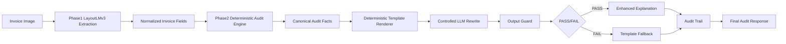

# Phase 3H Guarded Explanation Architecture

## Goal

Phase 3H changes the role of LoRA from decision maker to controlled language rewrite. Procurement audit facts, risk, anomaly types, and recommended action must come from deterministic Phase 2 logic. The official MVP explanation must be reproducible and safe even when no LLM is available.

## End-To-End Flow

## 1. Canonical Audit Facts

Canonical Audit Facts are the single source of truth for explanation generation.

They are produced by Phase 2 deterministic audit logic and are read-only for all downstream explanation modules. The generation model is not allowed to create, delete, rewrite, or reinterpret these facts.

Required fact groups:

- `anomaly_types`
- `evidence`
- `missing_fields`
- `risk_level`
- `recommended_action`

Rule: if a value is not present in Canonical Audit Facts, the explanation layer must say it is missing or not provided. It must not infer a PO number, GRN number, invoice number, vendor, amount, policy, approver, risk level, or action.

## 2. Deterministic Template Renderer

The template renderer is the default official MVP explanation path.

Properties:

- no model dependency
- no hallucination risk
- 100% reproducible for the same Canonical Audit Facts
- suitable for API and demo output before LoRA reaches hard gates

The renderer should produce a fixed structure, for example:

- summary
- anomaly types
- key evidence
- missing or unavailable fields
- risk level
- recommended action

## 3. Controlled LLM Rewrite

The controlled rewrite step may receive only:

- Canonical Audit Facts
- deterministic template output
- a strict rewrite prompt

It may improve language, readability, and tone. It must not add facts, remove facts, change decisions, change risk, change action, or invent policies and approvers.

Current LoRA adapters stay in shadow or experimental mode. They are not default user-facing output.

## 4. LoRA Output Guard

The guard validates any model rewrite before it can be used.

It must reject output that contains:

- unknown PO number
- unknown GRN number
- unknown invoice number
- unknown amount
- unknown vendor
- unknown policy
- unknown approver
- unknown anomaly type
- changed `risk_level`
- changed `recommended_action`
- missing required fixed sections

Any failed guard result means the LLM output is discarded.

## 5. Fallback Orchestrator

The orchestrator decides whether the final response uses the template or the rewritten explanation.

Fallback to deterministic template when:

- LoRA is unavailable
- LoRA output is empty
- output guard fails
- case is high risk
- model runtime fails
- model output cannot be parsed

MVP default: deterministic template.

## 6. Audit Trail

Every final explanation must be traceable.

Minimum trace fields:

- facts hash
- template version
- prompt version
- model version
- adapter version
- raw LLM output
- verifier result
- fallback reason
- final explanation

This makes the explanation path reviewable without trusting the model as a black box.

## 7. End-To-End Cases

| case | expected path |
| --- | --- |
| normal pass | Canonical Audit Facts -> template -> final response |
| single anomaly | facts -> template -> optional rewrite -> guard -> final response |
| multi anomaly | facts -> template with all anomalies -> optional rewrite -> guard -> final response |
| LLM pass guard | rewritten explanation may be used |
| LLM fail fallback | raw LLM output recorded, deterministic template returned |
| LLM unavailable fallback | deterministic template returned |

## Phase 3H.1 Implementation Boundary

Phase 3H.1 may implement the deterministic renderer, output guard, fallback orchestrator, and audit trace as isolated Phase 3 explanation components with tests.

It must not connect to the production API, modify Phase 1, modify Phase 2, start GPU training, or change the shared database schema unless the review/control conversation explicitly approves a cross-module contract change.
